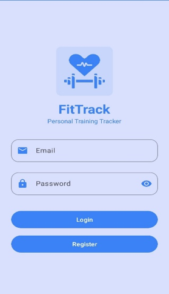
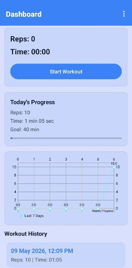
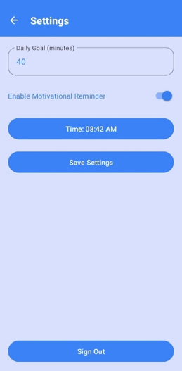

# FitTrack

Android fitness tracking application built with Java, Firebase Authentication, Cloud Firestore, and Android Sensors.

## Overview

FitTrack is a mobile fitness companion that helps users track workouts, monitor progress, and stay consistent with their fitness goals. The application uses the device accelerometer sensor to automatically detect and count exercise repetitions in real time.

## Features

* User registration and login with Firebase Authentication
* Secure cloud storage using Cloud Firestore
* Automatic repetition counting using the accelerometer sensor
* Workout history tracking
* Weekly progress charts and statistics
* Daily workout goals
* Motivational reminder notifications
* Background workout monitoring using a Foreground Service
* User preferences stored with SharedPreferences

## Technologies

* Java
* Android SDK
* Firebase Authentication
* Cloud Firestore
* MPAndroidChart
* Android Sensors (Accelerometer)
* Broadcast Receiver
* Foreground Service
* SharedPreferences

## Architecture

The application follows a multi-component Android architecture:

* SplashActivity - user authentication check
* AuthActivity - login and registration
* MainActivity - workout tracking dashboard
* SettingsActivity - goals and notification preferences
* WorkoutService - background workout monitoring
* ReminderReceiver - scheduled motivational notifications

## Screenshots

### Splash Screen

### Login Screen

### Main Dashboard

### Settings

## Future Improvements

* AI-based workout recommendations
* Additional exercise recognition algorithms
* Advanced analytics and performance insights
* Social and community features

## Author

Sara Tuvian
B.Sc. Software Engineering Student
Azrieli College of Engineering Jerusalem
